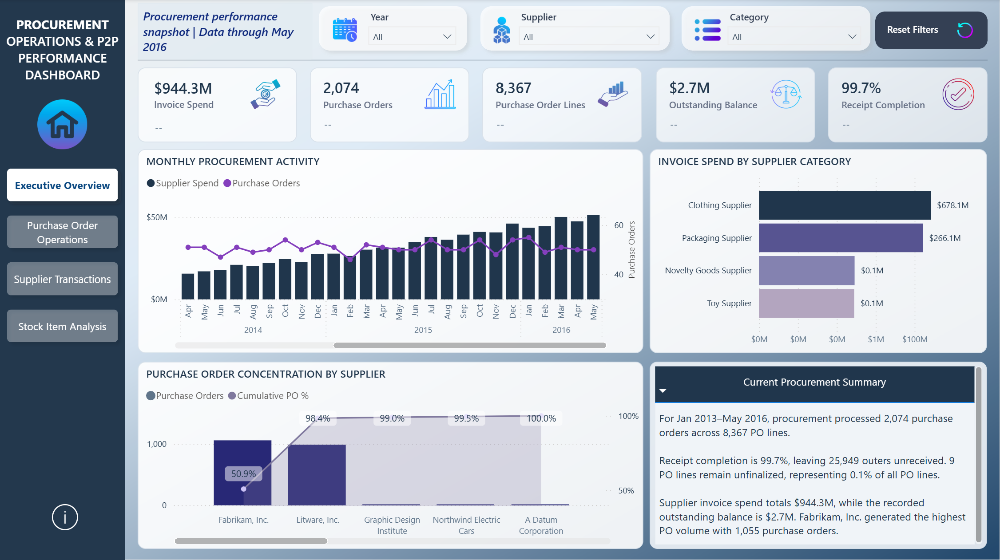
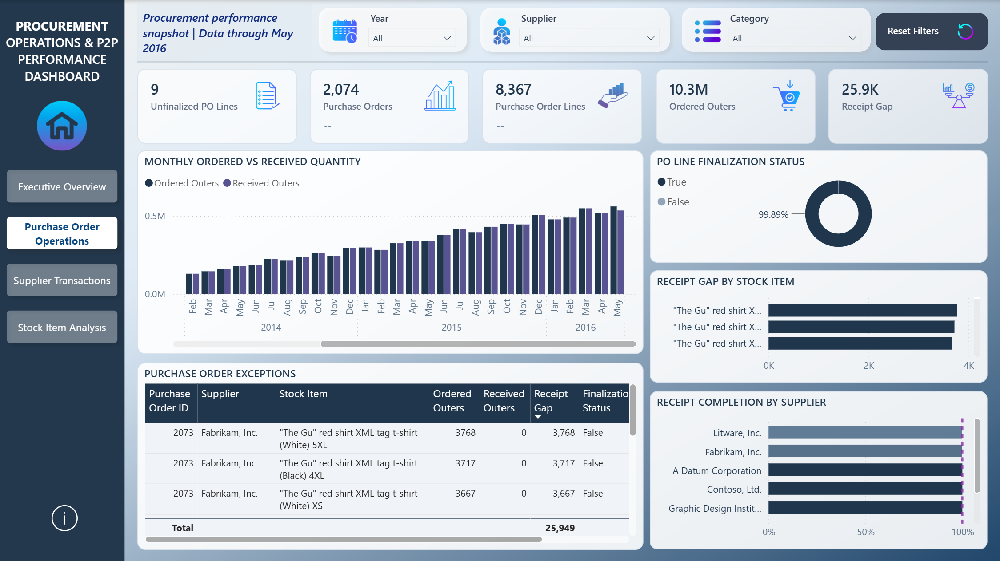
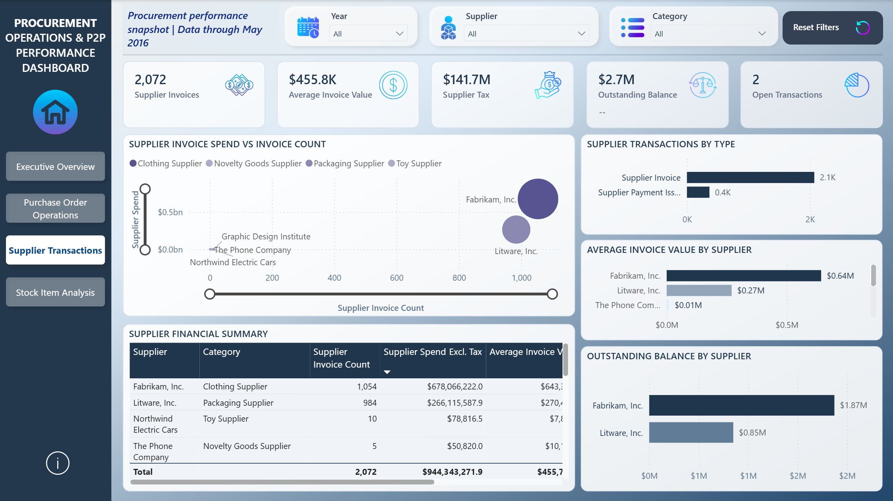
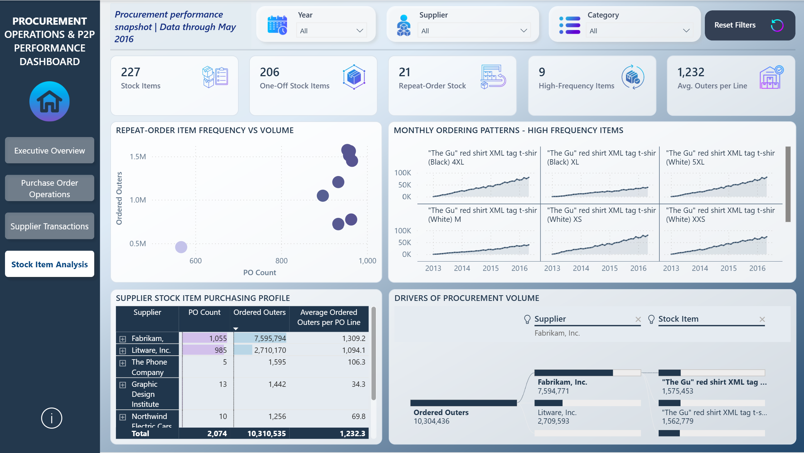
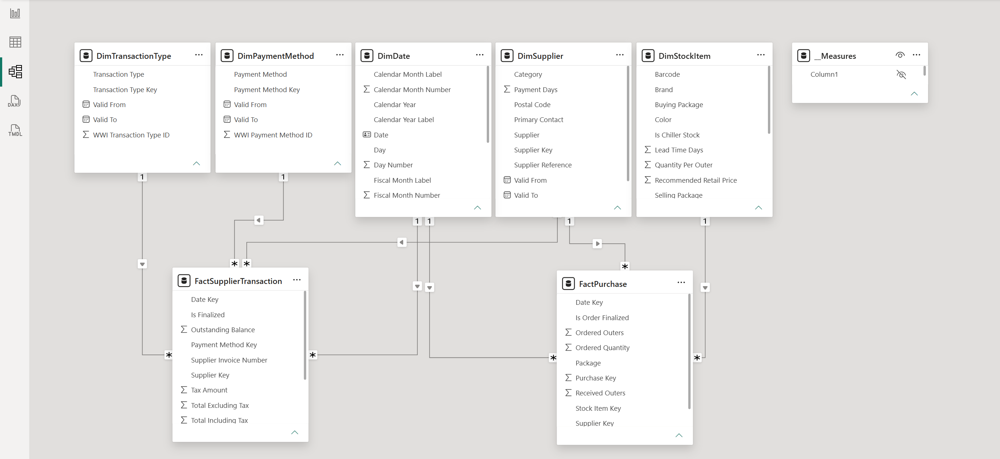

# Procure-to-Pay Analytics Dashboard

A **Power BI procurement analytics project** built using the Microsoft **Wide World Importers** sample data warehouse.

The dashboard brings together purchase-order activity and supplier financial transactions to provide visibility into **procurement spend, purchasing workload, receipt performance, supplier exposure, and stock-item purchasing patterns**.



---

## Project Objective

The purpose of this project was to build a procurement reporting solution that moves beyond basic spend reporting and answers practical Procure-to-Pay questions such as:

* How are supplier invoice spend and purchase-order activity changing over time?
* Which suppliers and categories drive procurement activity?
* Where is purchasing workload concentrated?
* How effectively are ordered quantities being received?
* Which purchase orders require operational attention?
* Where is supplier financial exposure concentrated?
* Which stock items are purchased once versus repeatedly?
* Which items generate disproportionately high procurement activity?

---

## Dashboard Overview

The report contains four analytical pages:

1. **Executive Overview**
2. **Purchase Order Operations**
3. **Supplier Transactions**
4. **Stock Item Analysis**

The report includes interactive **Year, Supplier, and Supplier Category slicers**, page navigation, KPI reference labels, drillable analysis, Top-N filtering, and dynamic procurement commentary.

---

## 1. Executive Overview

The Executive Overview provides a consolidated view of procurement performance, combining financial and operational metrics.

### Key KPIs

* Supplier Invoice Spend
* Purchase Orders
* Purchase Order Lines
* Outstanding Balance
* Receipt Completion %

The page also includes:

* Monthly supplier invoice spend and purchase-order activity
* Supplier-category spend distribution
* Purchase-order concentration by supplier
* Dynamic procurement summary


---

## 2. Purchase Order Operations

This page focuses on purchasing execution and operational exceptions.

Analysis includes:

* Ordered versus received quantities over time
* Receipt gaps by stock item
* Purchase-order line finalization status
* Receipt completion by supplier
* Purchase-order exceptions requiring further review



---

## 3. Supplier Transactions

The Supplier Transactions page provides the financial view of procurement activity.

Analysis includes:

* Supplier invoice count
* Average invoice value
* Supplier invoice tax
* Outstanding supplier balances
* Supplier invoice spend versus invoice volume
* Supplier transaction types
* Supplier-level financial summary
* Outstanding balance by supplier



---

## 4. Stock Item Analysis

This page analyzes purchasing patterns at stock-item level.

Key metrics include:

* Purchased Stock Items
* One-Off Stock Items
* Repeat-Order Stock Items
* High-Frequency Stock Items
* Average Order Quantity per PO Line

Analysis includes:

* Repeat-order item frequency versus ordered volume
* Monthly ordering patterns for high-frequency items
* Procurement volume decomposition by supplier and stock item
* Supplier–stock item purchasing profiles



---

## Key Business Insights

### Purchase-order workload is highly concentrated

**2,040 of 2,074 purchase orders — approximately 98.4% — are concentrated across Fabrikam and Litware.**

This indicates that a very small number of suppliers account for the majority of procurement transaction activity.

### Stock-item demand is heavily split between one-off and high-frequency purchasing

Across **227 purchased stock items**:

* **206** were purchased on only one purchase order
* **21** were repeat-order items
* **9** appeared on more than 100 purchase orders

This shows that most stock items are one-off purchases, while a very small core of items generates substantial recurring procurement workload.

### Receipt performance is strong

The dataset contains approximately **10.3 million ordered outers**, with overall receipt completion of approximately **99.7%**.

Only a relatively small quantity remains unreceived compared with total ordered volume.

### Procurement activity spans more than 8,000 PO lines

The report contains:

* **2,074 purchase orders**
* **8,367 purchase-order lines**

This provides enough transaction-level detail to analyze purchasing frequency, supplier workload, receipt performance, and stock-item ordering behavior.

### Significant supplier financial activity

Across the full dataset:

* Supplier invoice spend is approximately **$944.3M**
* Supplier invoice count is **2,072**
* Recorded outstanding balance is approximately **$2.7M**

The outstanding-balance measure is presented as recorded supplier transaction exposure rather than assumed overdue debt.

---

## Data Model

The report uses a dimensional model with two fact tables serving different analytical purposes.

### Fact Tables

**FactPurchase**

Purchase-order-line level activity used for:

* Purchase orders
* PO lines
* Ordered quantities
* Received quantities
* Receipt gaps
* PO finalization
* Stock-item analysis

**FactSupplierTransaction**

Supplier financial transactions used for:

* Supplier invoice spend
* Invoice count
* Tax
* Outstanding balances
* Transaction types
* Payment methods

### Shared Dimensions

* `DimDate`
* `DimSupplier`

### Supporting Dimensions

* `DimStockItem`
* `DimTransactionType`
* `DimPaymentMethod`

The fact tables are intentionally kept separate rather than joined directly at transaction level.



---

## Selected DAX Measures

### Cumulative PO %

Used to create the Pareto analysis of purchase-order concentration by supplier.

```DAX
Cumulative PO % =
VAR CurrentPOCount =
    [PO Count]

VAR CumulativePOs =
    CALCULATE(
        [PO Count],
        FILTER(
            ALLSELECTED(DimSupplier[Supplier]),
            [PO Count] >= CurrentPOCount
        )
    )

VAR TotalPOs =
    CALCULATE(
        [PO Count],
        ALLSELECTED(DimSupplier[Supplier])
    )

RETURN
DIVIDE(
    CumulativePOs,
    TotalPOs
)
```

This measure demonstrates the use of **filter context, CALCULATE, FILTER, and ALLSELECTED** to calculate a cumulative percentage while retaining external report selections.

### Outstanding Balance Reference

Used as a dynamic KPI reference label.

```DAX
Outstanding Balance Reference =
VAR SelectedYear =
    SELECTEDVALUE(DimDate[Calendar Year])

VAR BalanceShare =
    DIVIDE(
        [Outstanding Balance],
        [Supplier Spend Excl. Tax]
    )

RETURN
IF(
    ISBLANK(SelectedYear)
        || ISBLANK(BalanceShare),
    BLANK(),
    FORMAT(BalanceShare, "0.0%")
        & " of invoice spend"
)
```

The reference appears only when a single year is selected and expresses outstanding balance relative to supplier invoice spend within the current filter context.

### Receipt Completion %

```DAX
Receipt Completion % =
DIVIDE(
    [Received Outers],
    [Ordered Outers]
)
```

Measures the proportion of ordered supplier packaging units that were received.

### Repeat-Order Stock Items

```DAX
Repeat-Order Stock Items =
COUNTROWS(
    FILTER(
        VALUES(DimStockItem[WWI Stock Item ID]),
        CALCULATE([PO Count]) > 1
    )
)
```

Identifies stock items appearing on more than one distinct purchase order.

### Average Order Quantity per PO Line

```DAX
Average Ordered Outers per PO Line =
DIVIDE(
    [Ordered Outers],
    [PO Line Count]
)
```

Measures the average number of supplier outer-packaging units ordered each time an item appears on a PO line.

---

## Technical Skills Demonstrated

* Power BI Desktop
* DAX
* SQL Server
* Dimensional data modelling
* Star-schema design
* Fact and dimension modelling
* Filter context
* `CALCULATE`
* `FILTER`
* `ALLSELECTED`
* `SELECTEDVALUE`
* Dynamic KPI reference labels
* Pareto / cumulative analysis
* Top-N analysis
* Small multiples
* Decomposition trees
* Exception reporting
* Interactive slicers
* Page navigation
* Procurement KPI design

---

## Procurement Concepts Covered

The project demonstrates analytics across several Procure-to-Pay areas:

* Spend analysis
* Purchase-order activity
* Procurement workload
* Supplier concentration
* Invoice analysis
* Outstanding supplier balances
* Receipt performance
* Purchase-order exceptions
* Supplier transaction analysis
* Stock-item purchasing frequency
* One-off versus recurring purchasing
* Operational procurement performance

---

## Data Source

**Microsoft Wide World Importers Data Warehouse**

Data coverage used in this report:

**January 2013 – May 2016**

The original Microsoft sample dataset was repurposed into a procurement-focused analytical model.

> **Note on “Outers”:** In Wide World Importers, an *outer* represents a supplier packaging unit rather than necessarily one individual product unit. `Ordered Outers` and `Received Outers` therefore represent ordered and received supplier package quantities.

---

## Repository Structure

```text
procure-to-pay-analytics-powerbi/
│
├── README.md
│
├── dashboard/
│   └── Procure-to-Pay_Analytics_Dashboard.pbix
│
├── images/
│   ├── 01_Executive_Overview.png
│   ├── 02_Purchase_Order_Operations.png
│   ├── 03_Supplier_Transactions.png
│   ├── 04_Stock_Item_Analysis.png
│   └── 05_Data_Model.png
│
└── docs/
    └── metric_definitions.md
```

---

## Project Focus

This project was designed as a portfolio demonstration of how procurement data can be transformed into a structured reporting solution that connects **financial performance, operational execution, supplier activity, and purchasing behavior**.

The emphasis is not only on dashboard visualization, but also on **business metric definition, dimensional modelling, DAX logic, data interpretation, and procurement-focused decision support**.
